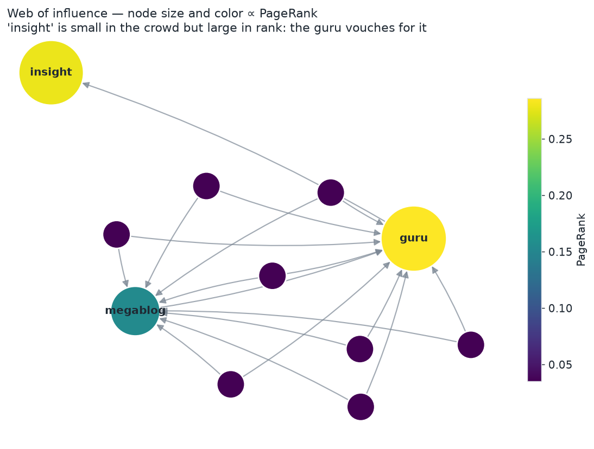
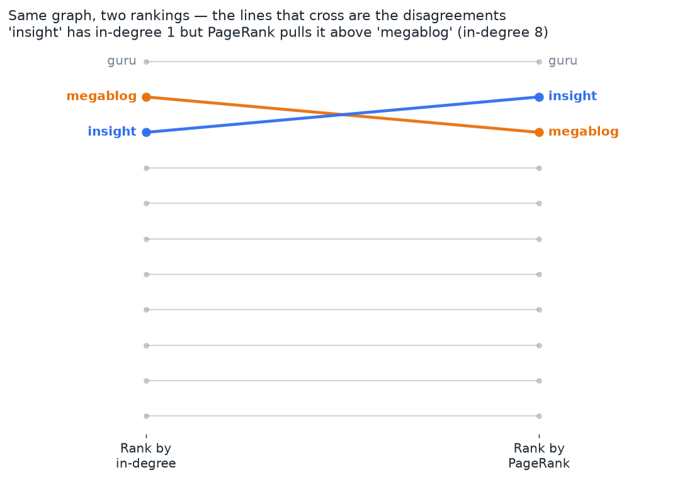
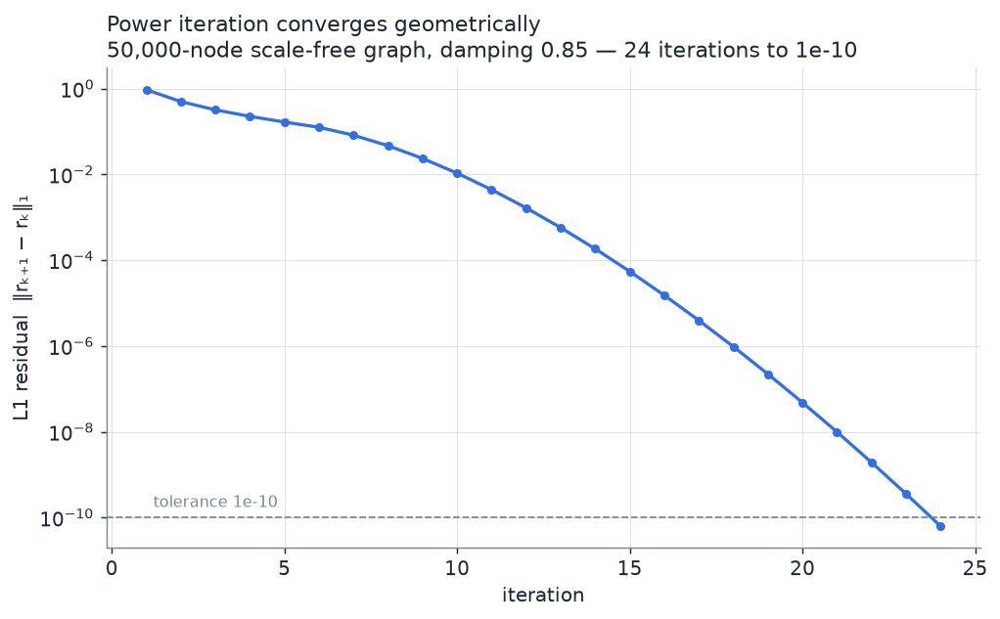

# PageRank from first principles

A small, honest implementation of **PageRank** — built from a graph's adjacency
structure up, not by calling a library's `pagerank()`. It constructs the Google
matrix, solves for the stationary distribution by power iteration, validates that
result against a true eigen-decomposition, scales to tens of thousands of nodes
with sparse matrices, and shows *why* PageRank beats counting in-links.



> Every node here is a page; an arrow is a link. Node size and color are each
> node's PageRank. `megablog` is linked by a crowd of casual users, yet the
> little `insight` post outranks it — because the one link `insight` receives
> comes from the high-ranked `guru`. That flip is the whole point of PageRank,
> and raw in-degree cannot see it.

---

## The idea: a random surfer

PageRank models someone browsing a directed graph of pages. At each step they do
one of two things:

- with probability **`d`** (the *damping factor*, conventionally `0.85`), they
  click a link chosen uniformly at random from the current page;
- with probability **`1 − d`**, they get bored and **teleport** to a page drawn
  from a distribution `v` (uniform by default).

A page's PageRank is the long-run fraction of time the surfer spends on it — the
**stationary distribution** of this random walk. Pages accumulate importance by
being linked from *other important pages*, so importance is defined recursively.
Teleportation is not a hack bolted on afterwards: it is what makes the walk
well-behaved (every page reachable, no traps), which in turn guarantees a unique
answer.

## The linear algebra

Let `A` be the adjacency matrix of `n` nodes, where `A[i, j] > 0` means there is
a link `i → j`.

**1. Normalize out-links.** Divide each row by its out-degree to get the
row-stochastic *hyperlink matrix* `H`:

```
H[i, j] = A[i, j] / out_degree(i)
```

Row `i` of `H` is now a probability distribution: "given that I'm on page `i` and
I follow a link, where do I land?"

**2. Fix dangling nodes.** A page with no out-links (a PDF, a leaf) gives an
all-zero row — the surfer would fall off the graph and probability would leak
away. We patch those rows so a dangling surfer teleports according to `v`.
Writing `d` for the dangling-node indicator, `H` becomes the row-stochastic

```
S = H + d·vᵀ
```

**3. Add teleportation.** Mix in the `(1 − d)` teleport step to get the
**Google matrix**:

```
G = d·S + (1 − d)·𝟙·vᵀ
```

`G` is row-stochastic, and because teleportation connects everything, it is also
irreducible and aperiodic. By the **Perron–Frobenius theorem** it has a unique
stationary row vector `π`:

```
π G = π,     π ≥ 0,     Σ π = 1
```

That `π` is the PageRank vector. It is the dominant left eigenvector of `G`
(eigenvalue 1).

**4. Solve by power iteration.** Rather than a full eigensolve (`O(n³)`, dense),
we start from `v` and repeatedly apply `r ← r·G`. Because the second-largest
eigenvalue of `G` has modulus `≤ d`, the error shrinks by roughly a factor of `d`
each step — geometric convergence, a few dozen iterations to full precision.

Crucially, we **never form `G`**. The update

```
r_new = d·(Hᵀ r) + (d·(dangling mass) + (1 − d))·v
```

is algebraically identical to `r ← r·G`, conserves total mass exactly (`Σ r = 1`
at every step), and uses only a sparse matrix–vector product. That single fact is
what lets the same routine run on a four-node toy and a 50,000-node web.

## Install

```bash
git clone <this-repo> && cd pagerank
python -m pip install -r requirements.txt
python -m pip install -e .        # optional: install the package itself
```

Requires Python ≥ 3.9. The core (`numpy`, `scipy`) is all that's needed to
compute PageRank; `matplotlib` and `networkx` are only for the `examples/`
figures.

## Quick start

```python
import numpy as np
from pagerank import DiGraph, pagerank, pagerank_eig

# Build a graph from an edge list.
g = DiGraph.from_edges([("A", "B"), ("A", "C"), ("B", "C"), ("C", "A"), ("D", "C")])

# Rank the nodes (most important first).
for node, score in g.rank():
    print(f"{node}: {score:.4f}")
# C: 0.3941   A: 0.3725   B: 0.1958   D: 0.0375

# Or work directly with an adjacency matrix.
A = g.adjacency_matrix()
scores = pagerank(A, damping=0.85)          # power iteration
assert np.allclose(scores, pagerank_eig(A)) # matches the true eigenvector
assert np.isclose(scores.sum(), 1.0)        # it's a probability distribution
```

Node `C` wins because everyone (A, B, D) links to it and it trades weight back
and forth with `A`; `D` loses because nothing links to it, so it survives only on
teleportation.

## Why it beats counting in-links

Counting in-links (in-degree centrality) treats every endorsement as equal. It
cannot tell a link from a trusted authority apart from a link from a throwaway
page. PageRank can, because a page's score depends on the scores of the pages
linking to it.

`examples/indegree_vs_pagerank.py` builds a graph designed to expose the gap and
ranks it both ways:

| node       | in-degree | in-degree rank | PageRank | PageRank rank |
| ---------- | --------: | -------------: | -------: | ------------: |
| guru       |       9   |            1   |  0.2860  |          1    |
| **insight**|     **1** |          **3** |**0.2783**|        **2**  |
| **megablog**|    **8** |          **2** |**0.1546**|        **3**  |
| user01–08  |       0   |          4–11  |  0.0351  |         4–11  |

`megablog` is linked by eight casual users; `insight` is linked by exactly one
page. In-degree ranks `megablog` above `insight`. **PageRank reverses them** —
`insight`'s single link comes from `guru`, the most important node in the graph,
and `guru` passes nearly all of its rank straight to `insight`. Being vouched for
by something important beats being pointed at by a crowd of nobodies.



## Scaling with sparse matrices

`examples/benchmark_sparse.py` generates directed scale-free graphs (preferential
attachment — "rich get richer", which produces the heavy-tailed in-degree
distribution of the real web) and runs the sparse solver. Since each iteration is
one sparse matrix–vector product, cost scales with the number of *edges*, not
`n²`:

| nodes  | edges   | iterations to 1e-10 | solve time |
| -----: | ------: | ------------------: | ---------: |
|  1,000 |   4,000 |                 19  |   ~0.001 s |
| 10,000 |  40,000 |                 22  |   ~0.003 s |
| 50,000 | 200,000 |                 24  |   ~0.022 s |

(Timings from one laptop run; yours will differ, but the *shape* — near-constant
iteration count, time growing with edges — is the point.) Notice the iteration
count barely moves as the graph grows 50×: convergence depends on the damping
factor, not the size.



## Personalized (topic-biased) PageRank

Change the teleport distribution `v` from uniform to a favorite node (or topic
set) and the whole ranking tilts toward pages near that node. This is the
mechanism behind "related pages" and topic-sensitive search.

```python
# Bias the random surfer to teleport back to "user01".
g.pagerank(personalization={"user01": 1.0})
```

`examples/personalized_pagerank.py` compares uniform teleportation against two
personalized runs. See `figures/personalized.png`.

## What's in the box

```
pagerank/
├── core.py        # Google matrix, power iteration, eigen reference (dense, NumPy)
├── sparse.py      # same math on SciPy CSR matrices, for large graphs
├── graph.py       # DiGraph: named nodes, edge lists, adjacency views, ranking
└── datasets.py    # tiny hand-computable graph, the influence graph, scale-free generator
tests/             # pytest suite (see below)
examples/          # scripts that print results and save figures into figures/
figures/           # generated PNGs (committed, embedded above)
```

Public API: `pagerank`, `power_iteration`, `pagerank_eig`, `google_matrix`,
`hyperlink_matrix`, `pagerank_sparse`, `DiGraph`, and `datasets`.

## Tests

```bash
pytest -q
```

The suite covers, among other things, the three validations the project is built
around:

1. **Power iteration matches the dominant eigenvector.** On small graphs the
   result is compared against `numpy.linalg.eig` of the Google matrix
   (`tests/test_validation.py`, plus randomized graphs in `tests/test_core.py`).
2. **The output is a genuine probability distribution that converges** —
   non-negative, sums to 1, residual driven below tolerance — including on graphs
   with dangling nodes.
3. **A tiny hand-computable graph yields the expected order** (`C > A > B > D`).

It also checks the sparse solver against the dense one, the `DiGraph` container,
personalization, weighted edges, input validation, and the headline
in-degree-vs-PageRank disagreement.

## Honest caveats

- `pagerank_eig` is a **reference for testing**, not a scalable method: it forms
  the dense `G` and calls a general eigensolver (`O(n³)`). Use `pagerank` /
  `pagerank_sparse` for real work.
- The dense path materializes an `n × n` matrix, so it's fine into the low
  thousands of nodes; beyond that use `sparse=True` / `pagerank_sparse`.
- The "scale-free" generator is a compact preferential-attachment model for
  *demonstration*. It is not a scraped web graph, and real graphs have structure
  (reciprocity, communities) it doesn't capture.
- Convergence rate is governed by the damping factor: closer to 1 means a more
  faithful model but slower convergence and greater sensitivity to graph
  structure. `0.85` is the conventional compromise, not a law of nature.

## License

MIT — see [LICENSE](LICENSE).
